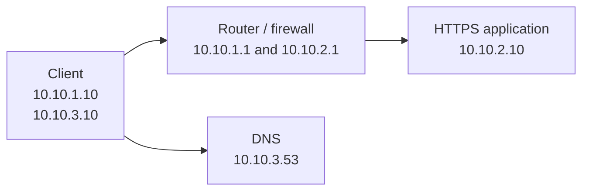

# Lab 01: Locate the Failing Stage of a Connection

## 1. Lab outcome

Given a failed HTTPS transaction, you will identify the last working stage,
collect evidence at the failing boundary, repair the actual fault, and verify
the original transaction from name resolution through the application.

> **Implementation status:** the known-good Part B topology, all four initial
> scenarios, `local-delivery`, `transport-failure`, and `application-failure`
> work end to end, including reset and lifecycle tests. Randomized challenge
> mode is also implemented and covered across every eligible scenario.

## 2. Relationship to the Reece.AI lesson

This lab supports **The Network Model I Use to Troubleshoot Everything**. The
lesson supplies the mental model; this repository will supply the executable
environment. The investigation follows six stages:

1. Name resolution
2. Local delivery
3. Forward and return path
4. Policy and translation
5. TCP or UDP transport
6. TLS, authentication, and application

Read the [network model lesson] for the deeper explanation of this method. The
intended public [course] and [lab page] URLs must be confirmed before release.

## 3. Time, cost, level, and tested versions

| Attribute | Current value |
| --- | --- |
| Estimated time | Not yet measured on a clean learner walkthrough |
| Cost | No cloud cost; local compute, storage, and download usage only |
| Level | Foundational |
| Last-tested host | Ubuntu 24.04.5 LTS, Linux 6.17, x86_64 |
| Last-tested tools | Containerlab 0.79.0, Docker Engine 27.5.1, OpenSSL 3.0.13 |
| Service images | CoreDNS 1.14.7, NGINX 1.30.5 on Alpine 3.24 |
| Last baseline and scenario test | September 27, 2026 |

The known-good baseline and every named scenario passed on this reference
environment. The lab remains in development until challenge mode and a clean
learner walkthrough are complete.

## 4. Prerequisites and supported platforms

Part A requires a hostname you own or are authorized to test. It makes no host
changes.

Part B requires native Linux, Docker Engine, Containerlab, Git, GNU Make, Bash,
OpenSSL, an OpenSSH client, and initial Internet access for packages and
images. Read the repository [environment requirements], [installation guide],
and [supported platforms] before attempting it.

## 5. Part A — Observe a real connection

Only test a target you own or are explicitly authorized to test. These steps
observe state and send ordinary DNS, TCP, TLS, and HTTP requests. They must not
change DNS settings, routes, firewall policy, the hosts file, or certificate
trust.

### Record the flow first

Create a record before troubleshooting:

| Field | Your observation |
| --- | --- |
| Source host and address | |
| Destination hostname | |
| Resolved destination address | |
| Protocol and port | TCP/443 |
| Observation time and time zone | |
| Expected result | Validated TLS and the expected HTTPS response |

### Linux observations

Set `TARGET` to the authorized hostname and, after resolving it, set `ADDRESS`
to one returned address:

```bash
TARGET=example.test
ADDRESS=192.0.2.10

date -Is
ip address show
dig "$TARGET"
ip neighbor show
ip route get "$ADDRESS"
nc -vz "$TARGET" 443
openssl s_client -connect "${TARGET}:443" -servername "$TARGET" </dev/null
curl --verbose --connect-timeout 5 "https://${TARGET}/"
```

Replace the documentation-only example values before running the commands.
`192.0.2.10` is a reserved documentation address and is not a test target.

### Windows PowerShell observations

Run these in PowerShell against the same authorized target:

```powershell
$Target = 'example.test'
$Address = '192.0.2.10'

Get-Date -Format o
Get-NetIPConfiguration
Resolve-DnsName $Target
Get-NetNeighbor
Find-NetRoute -RemoteIPAddress $Address
Test-NetConnection -ComputerName $Target -Port 443 -InformationLevel Detailed
curl.exe --verbose --connect-timeout 5 "https://$Target/"
```

Set `$Address` to an address returned by `Resolve-DnsName`; the example value
is reserved for documentation. `curl.exe` is named explicitly so PowerShell
does not substitute a shell alias on versions where one exists.

### What the evidence proves

| Observation | What it supports | What it does not prove |
| --- | --- | --- |
| `dig` or `Resolve-DnsName` | DNS returned a particular answer at that time | That the address is reachable or serving the right application |
| Interface and neighbor state | Local addressing and currently known adjacent mappings | End-to-end routing or remote health |
| Route selection | The local kernel selected an egress path and next hop | That every forward and return hop works |
| TCP connection test | A TCP handshake to the selected name and port completed | Certificate identity or correct HTTP behavior |
| TLS output | The peer presented a certificate and TLS negotiation progressed | Correct application content unless identity and trust are also checked |
| `curl` without insecure options | DNS, TCP, certificate validation, TLS, and an HTTP exchange progressed | The internal health of every application dependency |

Save the flow record and identify the last stage for which you have positive
evidence. Avoid treating ping as proof of HTTPS health.

## Part B — Troubleshoot the isolated lab

The rest of this guide runs inside the deterministic Containerlab environment.
Unless a step explicitly says otherwise, run lifecycle and `make` commands
from the Lab 01 directory on the Linux host.

## 6. Architecture and addressing

Part B uses only Linux containers and freely redistributable images. The
application will not use the host network or publish HTTPS outside the lab.



[`configs/lab.env`](configs/lab.env) is the executable source of truth for
names, images, and addresses. This table mirrors it for learners.

| Segment or name | Value | Purpose |
| --- | --- | --- |
| Client segment | `10.10.1.0/24` | Client-to-router link |
| Client, routed link | `10.10.1.10` | Origin of the HTTPS transaction |
| Router, client side | `10.10.1.1` | Application next hop and policy boundary |
| Application segment | `10.10.2.0/24` | Router-to-server link |
| Router, application side | `10.10.2.1` | Application-side gateway and observation point |
| HTTPS application | `10.10.2.10` | TLS and HTTP endpoint |
| DNS segment | `10.10.3.0/24` | Direct client-to-DNS link |
| Client, DNS link | `10.10.3.10` | Source of lab DNS queries |
| DNS | `10.10.3.53` | Lab-local authoritative resolver |
| Application name | `app.lab.test` | Original transaction hostname |
| Application service | TCP/443 | Original transaction transport |

The design must allow captures on both sides of the router so a learner can
prove whether a SYN left the client, crossed the policy boundary, reached the
server, and received a returning response.

## 7. Environment validation

From the lab directory, run the read-only host check:

```bash
make check
```

It validates Linux, Docker access, Containerlab, OpenSSL, OpenSSH, Make, and
the host's forwarding sysctl interface. It does not deploy or change the lab.

## 8. Deployment

From this lab directory, build the local images and deploy the topology:

```bash
make build
make deploy
```

Deployment generates a lab-only CA, a valid certificate for `app.lab.test`,
and a deliberately incorrect certificate for the TLS scenario. It also creates
an ephemeral SSH identity for the client. Private keys remain under the ignored
`.state/` directory. Deployment then creates the isolated topology and applies
the known-good addresses and routes.

No application port is published on the host. Containerlab creates a private
management network named `lab01-mgmt`; the original HTTPS transaction uses
only the three data-plane links shown above.

## 9. Known-good baseline

Run:

```bash
make baseline
```

The command proves, in order:

1. `app.lab.test` resolves to `10.10.2.10`.
2. The selected route crosses the router/firewall.
3. TCP/443 completes.
4. TLS presents the expected identity and validates against the lab CA.
5. HTTPS returns the expected application response.

Save this evidence before activating any future scenario. You can repeat the
original transaction at any time with `make verify`.

## 10. Enter the lab nodes and test the six stages

The lab provides short host-side commands for each node you need to inspect:

| Command | Destination | Access method |
| --- | --- | --- |
| `make client` | Diagnostic client | Key-authenticated SSH |
| `make router` | Router/firewall | Interactive container shell |
| `make server` | HTTPS application server | Interactive container shell |

Run these commands from separate host terminals when you need simultaneous
captures or connection tests. Type `exit` to leave any node shell.

### Enter the client

Open an SSH session from the **host terminal**:

```bash
make client
```

The helper uses the generated key and connects to the client's fixed
management address, `172.31.1.10`. The equivalent command is:

```bash
ssh -i .state/ssh/id_ed25519 \
  -o IdentitiesOnly=yes \
  -o StrictHostKeyChecking=accept-new \
  -o UserKnownHostsFile=.state/ssh/known_hosts \
  root@172.31.1.10
```

The prompt that opens is the **client container**. Run the following checks
there. Type `exit` to return to the host. These are observations, not a script:
record what each command proves and stop where the evidence stops.

The login banner summarizes the original transaction and a short set of useful
commands. Run `lab-help` at any time to display it again.

### Stage 1 — Name resolution

```bash
dig app.lab.test
dig @10.10.3.53 app.lab.test
```

The first query exercises the client's configured resolver; the second asks
the lab DNS service explicitly. An answer proves only that DNS returned an
address, not that the application is reachable.

### Stage 2 — Local delivery

```bash
ip -brief address
ip neighbor show
ip route get 10.10.3.53
```

These show local interfaces, learned neighbor mappings, and how the directly
connected DNS address will be reached. They do not prove the routed application
path.

### Stage 3 — Forward and return path

```bash
ip route get 10.10.2.10
traceroute -n -T -p 443 10.10.2.10
```

The route lookup should select `10.10.1.1` on `eth1`; TCP traceroute should
show the router and application. A route existing locally does not prove the
return path works.

### Stage 4 — Policy and translation

On the **client**, observe the target flow while repeating a connection test
in a second client session:

```bash
tcpdump -ni eth1 'host 10.10.2.10 and tcp port 443'
```

Policy lives at the router boundary, so client evidence alone cannot prove
what the router accepted, dropped, or translated. From a second **host
terminal**, enter the router:

```bash
make router
```

Then inspect policy and connection tracking inside the **router container**:

```bash
nft list ruleset
conntrack -L -p tcp
tcpdump -ni eth1 'host 10.10.2.10 and tcp port 443'
tcpdump -ni eth2 'host 10.10.1.10 and tcp port 443'
```

Compare the client-side and application-side interfaces. Stop each capture
with Ctrl-C and type `exit` to return to the host.

### Stage 5 — TCP transport

Back in the **client container**, run:

```bash
nc -vz -w 3 10.10.2.10 443
ss -tn
```

A successful connection proves that TCP/443 completed. It does not prove TLS
identity, trust, or the expected application response.

### Stage 6 — TLS and application

```bash
openssl s_client \
  -connect 10.10.2.10:443 \
  -servername app.lab.test \
  -CAfile /etc/lab/ca.crt \
  -verify_hostname app.lab.test \
  -verify_return_error </dev/null

curl --verbose \
  --cacert /etc/lab/ca.crt \
  https://app.lab.test/
```

OpenSSL explicitly checks the expected name and lab trust chain. Curl repeats
the original transaction, including DNS, TCP, TLS validation, and HTTP.

When DNS is suspect, this **diagnostic bypass** holds the destination address
constant while retaining the correct TLS name:

```bash
curl --verbose \
  --resolve app.lab.test:443:10.10.2.10 \
  --cacert /etc/lab/ca.crt \
  https://app.lab.test/
```

That result can isolate DNS from later stages, but it is not proof of repair.
`make verify` deliberately does not bypass DNS.

## 11. Tasks and checkpoints

For each scenario:

1. Define the original flow.
2. Reproduce the learner-visible symptom.
3. Test the six stages in order until evidence stops.
4. Observe both sides of the last successful boundary.
5. State the root cause and the evidence that distinguishes it.
6. Repair the actual state without using `reset`.
7. Run `make verify` to repeat the original HTTPS transaction.

## 12. Break and troubleshoot scenarios

The four initial scenarios and all three subsequent scenarios are deterministic,
idempotent, reversible, and available:

| Scenario | Status | Learner-visible boundary |
| --- | --- | --- |
| `dns-failure` | Implemented | Name resolution fails while the later stages remain healthy. |
| `local-delivery` | Implemented | The client cannot resolve the configured next hop, so no HTTPS packet leaves it. |
| `return-route` | Implemented | The request travels forward, but the response cannot return. |
| `policy-drop` | Implemented | Correctly routed HTTPS traffic is silently dropped at the policy boundary. |
| `transport-failure` | Implemented | The application host rejects TCP/443 because no HTTPS listener is running. |
| `wrong-certificate` | Implemented | TCP succeeds, but certificate validation for `app.lab.test` fails. |
| `application-failure` | Implemented | DNS through TLS succeed, but HTTPS returns status 500. |

From the **host terminal**, activate one implemented scenario:

```bash
# Choose one scenario.
make scenario SCENARIO=dns-failure
make scenario SCENARIO=local-delivery
make scenario SCENARIO=return-route
make scenario SCENARIO=policy-drop
make scenario SCENARIO=transport-failure
make scenario SCENARIO=wrong-certificate
make scenario SCENARIO=application-failure
make status
```

Normal learner output will describe only the symptom and task. Mutation detail
is reserved for ignored instructor/debug state. Enter the client, work through
the six stages, repair the identified state, and run `make verify` from the
host.

### Challenge mode

After proving the known-good baseline, ask the lab to select one of the seven
failures without revealing its identity:

```bash
make challenge
make status
```

`make challenge` first restores and verifies the baseline, randomly applies one
supported failure, and prints only the common symptom and troubleshooting task.
`make status` reports topology and node state without naming the failure.

Work through the same six stages, repair the actual state, and run
`make verify`. The active marker records only `challenge`. Do not inspect
`.state/scenario-debug.log`, `.state/challenge-apply.log`, or the solution
documents during the exercise: those are instructor and maintainer artifacts
that can disclose the answer. `make reset` remains the recovery escape hatch if
you cannot complete a manual repair.

CoreDNS reads its runtime zone from `.state/dns/db.lab.test` on the host and
reloads it when its SOA serial increases. The application container's route to
the client subnet can be inspected with `docker exec clab-lab01-web ip route`.
The client's selected next hop and neighbor state can be inspected with
`ip route get 10.10.2.10` and `ip neighbor` after running `make client`. Router
policy can be inspected with `make router` and `nft list ruleset`. The HTTPS
service process and configuration can be inspected after running `make server`.
The rendered active and known-good application configurations are
`.state/web/nginx.conf` and `.state/web/baseline-nginx.conf` on the host. Use
`openssl s_client` from the client to inspect the presented TLS identity. Use
these only after evidence identifies the relevant stage. `make reset` restores
and verifies the baseline if you need an escape hatch; it is not the normal
learner repair.

Maintainers can exercise deployment, two consecutive applications of each
scenario, every eligible hidden challenge, a random challenge, failure
assertions, reset, verification, and teardown with:

```bash
make test
```

The test always tears down its topology, including after a failed assertion.

## 13. Scenario solutions

The solution guides contain spoilers and exact repair steps. Use them after
completing an investigation or when reviewing collected evidence:

- [DNS failure solution](solutions/dns-failure.md)
- [Local-delivery solution](solutions/local-delivery.md)
- [Return-route solution](solutions/return-route.md)
- [Policy-drop solution](solutions/policy-drop.md)
- [Transport-failure solution](solutions/transport-failure.md)
- [Wrong-certificate solution](solutions/wrong-certificate.md)
- [Application-failure solution](solutions/application-failure.md)

Every scenario currently eligible for challenge mode has a corresponding
solution document.

## 14. Verification

The command:

```bash
make verify
```

verifies the original DNS and HTTPS transaction without repairing it. A pass
requires the expected DNS answer, TCP/443, a trusted certificate with the
expected identity, and the exact application response. Ping, an open port
alone, or an arbitrary HTTP response does not count as repair evidence.

## 15. Teardown and cost control

Run `make destroy` when finished. It removes only the `lab01` topology, its
Containerlab directory, and locally generated `.state/` files. It is safe to
repeat after a partial deployment. No public cloud resources are created. Do
not use broad Docker cleanup commands on a shared host.

## 16. Troubleshooting the lab environment

Use the repository's [environment troubleshooting guide] for Docker,
Containerlab, image, permission, or host-kernel problems. Keep those separate
from the deliberate in-lab faults that form the exercise.

## 17. Related lesson and source links

- [The Network Model I Use to Troubleshoot Everything][network model lesson]
- [Enterprise Networking for Systems Engineers course][course]
- [Locate the Failing Stage of a Connection lab page][lab page]
- [Containerlab documentation]
- [Repository root](../..)

[Containerlab documentation]: https://containerlab.dev/
[course]: https://reece.ai/learn/enterprise-networking-for-systems-engineers
[environment requirements]: ../../docs/environment-requirements.md
[environment troubleshooting guide]: ../../docs/troubleshooting-the-lab-environment.md
[installation guide]: ../../docs/installing-containerlab.md
[lab page]: https://reece.ai/labs/locate-the-failing-stage-of-a-connection
[network model lesson]: http://localhost:3000/learn/enterprise-networking/network-model
[supported platforms]: ../../docs/supported-platforms.md
