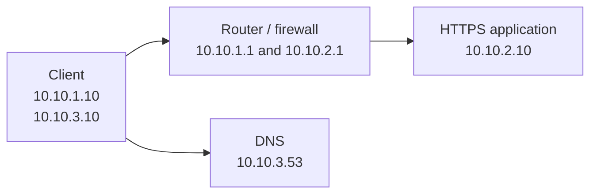

# Lab 01: Locate the Failing Stage of a Connection

## 1. Lab outcome

Given a failed HTTPS transaction, you will identify the last working stage,
collect evidence at the failing boundary, repair the actual fault, and verify
the original transaction from name resolution through the application.

> **Implementation status:** the known-good Part B topology, deployment,
> baseline, verification, status, and teardown workflows are implemented. The
> four controlled failure scenarios, reset, challenge mode, and lifecycle test
> are not implemented yet.

## 2. Relationship to the Reece.AI lesson

This lab supports **The Network Model I Use to Troubleshoot Everything**. The
lesson supplies the mental model; this repository will supply the executable
environment. The investigation follows six stages:

1. Name resolution
2. Local delivery
3. Forward and return path
4. Policy and translation
5. TCP or UDP transport
6. TLS, authentication, and application

The intended [course] and [lab page] URLs must be confirmed before release.

## 3. Time, cost, level, and tested versions

| Attribute | Current value |
| --- | --- |
| Estimated time | To be measured after the failure scenarios are implemented |
| Cost | No cloud cost; local compute, storage, and download usage only |
| Level | Foundational |
| Last-tested host | Ubuntu 24.04.5 LTS, Linux 6.17, x86_64 |
| Last-tested tools | Containerlab 0.79.0, Docker Engine 27.5.1, OpenSSL 3.0.13 |
| Service images | CoreDNS 1.14.7, NGINX 1.30.5 on Alpine 3.24 |
| Last baseline test | September 27, 2026 |

The known-good baseline passed on this reference environment. The lab is not
complete or published until every failure scenario passes the full lifecycle.

## 4. Prerequisites and supported platforms

Part A requires a hostname you own or are authorized to test. It makes no host
changes.

Part B will require native Linux, Docker Engine, Containerlab, Git, GNU Make,
Bash, and initial Internet access for packages and images. Read the repository
[environment requirements], [installation guide], and [supported platforms]
before attempting it.

## 5. Architecture and addressing

Part B will use only Linux containers and freely redistributable images. The
application will not use the host network or publish HTTPS outside the lab.



[`configs/lab.env`](configs/lab.env) is the executable source of truth for
names, images, and addresses. This table mirrors it for learners.

| Segment or name | Value | Purpose |
| --- | --- | --- |
| Client segment | `10.10.1.0/24` | Client-to-router link |
| Client, routed link | `10.10.1.10` | Origin of the HTTPS transaction |
| Router, client side | `10.10.1.1` | Application next hop and policy boundary |
| Application segment | `10.10.2.0/24` | Router-to-server link |
| Router, application side | `10.10.2.1` | Application-side gateway and observation point |
| HTTPS application | `10.10.2.10` | TLS and HTTP endpoint |
| DNS segment | `10.10.3.0/24` | Direct client-to-DNS link |
| Client, DNS link | `10.10.3.10` | Source of lab DNS queries |
| DNS | `10.10.3.53` | Lab-local authoritative resolver |
| Application name | `app.lab.test` | Original transaction hostname |
| Application service | TCP/443 | Original transaction transport |

The design must allow captures on both sides of the router so a learner can
prove whether a SYN left the client, crossed the policy boundary, reached the
server, and received a returning response.

## 6. Part A — Observe a real connection

Only test a target you own or are explicitly authorized to test. These steps
observe state and send ordinary DNS, TCP, TLS, and HTTP requests. They must not
change DNS settings, routes, firewall policy, the hosts file, or certificate
trust.

### Record the flow first

Create a record before troubleshooting:

| Field | Your observation |
| --- | --- |
| Source host and address | |
| Destination hostname | |
| Resolved destination address | |
| Protocol and port | TCP/443 |
| Observation time and time zone | |
| Expected result | Validated TLS and the expected HTTPS response |

### Linux observations

Set `TARGET` to the authorized hostname and, after resolving it, set `ADDRESS`
to one returned address:

```bash
TARGET=example.test
ADDRESS=192.0.2.10

date -Is
ip address show
dig "$TARGET"
ip neighbor show
ip route get "$ADDRESS"
nc -vz "$TARGET" 443
openssl s_client -connect "${TARGET}:443" -servername "$TARGET" </dev/null
curl --verbose --connect-timeout 5 "https://${TARGET}/"
```

Replace the documentation-only example values before running the commands.
`192.0.2.10` is a reserved documentation address and is not a test target.

### Windows PowerShell observations

Run these in PowerShell against the same authorized target:

```powershell
$Target = 'example.test'
$Address = '192.0.2.10'

Get-Date -Format o
Get-NetIPConfiguration
Resolve-DnsName $Target
Get-NetNeighbor
Find-NetRoute -RemoteIPAddress $Address
Test-NetConnection -ComputerName $Target -Port 443 -InformationLevel Detailed
curl.exe --verbose --connect-timeout 5 "https://$Target/"
```

Set `$Address` to an address returned by `Resolve-DnsName`; the example value
is reserved for documentation. `curl.exe` is named explicitly so PowerShell
does not substitute a shell alias on versions where one exists.

### What the evidence proves

| Observation | What it supports | What it does not prove |
| --- | --- | --- |
| `dig` or `Resolve-DnsName` | DNS returned a particular answer at that time | That the address is reachable or serving the right application |
| Interface and neighbor state | Local addressing and currently known adjacent mappings | End-to-end routing or remote health |
| Route selection | The local kernel selected an egress path and next hop | That every forward and return hop works |
| TCP connection test | A TCP handshake to the selected name and port completed | Certificate identity or correct HTTP behavior |
| TLS output | The peer presented a certificate and TLS negotiation progressed | Correct application content unless identity and trust are also checked |
| `curl` without insecure options | DNS, TCP, certificate validation, TLS, and an HTTP exchange progressed | The internal health of every application dependency |

Save the flow record and identify the last stage for which you have positive
evidence. Avoid treating ping as proof of HTTPS health.

## 7. Environment validation

From the lab directory, run the read-only host check:

```bash
make check
```

It validates Linux, Docker access, Containerlab, OpenSSL, Make, and the host's
forwarding sysctl interface. It does not deploy or change the lab.

## 8. Deployment

From this lab directory, build the local images and deploy the topology:

```bash
make build
make deploy
```

Deployment generates a lab-only CA, a valid certificate for `app.lab.test`,
and a deliberately incorrect certificate for a later scenario. Private keys
remain under the ignored `.state/` directory. Deployment then creates the
isolated topology and applies the known-good addresses and routes.

No application port is published on the host. Containerlab creates a private
management network named `lab01-mgmt`; the original HTTPS transaction uses
only the three data-plane links shown above.

## 9. Known-good baseline

Run:

```bash
make baseline
```

The command proves, in order:

1. `app.lab.test` resolves to `10.10.2.10`.
2. The selected route crosses the router/firewall.
3. TCP/443 completes.
4. TLS presents the expected identity and validates against the lab CA.
5. HTTPS returns the expected application response.

Save this evidence before activating any future scenario. You can repeat the
original transaction at any time with `make verify`.

## 10. Tasks and checkpoints

For each scenario:

1. Define the original flow.
2. Reproduce the learner-visible symptom.
3. Test the six stages in order until evidence stops.
4. Observe both sides of the last successful boundary.
5. State the root cause and the evidence that distinguishes it.
6. Repair the actual state without using `reset`.
7. Run `make verify` to repeat the original HTTPS transaction.

## 11. Break and troubleshoot scenarios

The first implementation will provide four deterministic, idempotent, and
reversible scenarios:

| Scenario | Learner-visible boundary |
| --- | --- |
| `dns-failure` | Name resolution fails or returns the wrong lab address. |
| `return-route` | The request travels forward, but the response cannot return. |
| `policy-drop` | Correctly routed HTTPS traffic is silently dropped at the policy boundary. |
| `wrong-certificate` | TCP succeeds, but certificate validation for `app.lab.test` fails. |

The eventual interface will be:

```bash
make scenario SCENARIO=dns-failure
make challenge
make status
```

Normal learner output will describe only the symptom and task. Mutation detail
will be reserved for instructor/debug evidence.

## 12. Verification

The command:

```bash
make verify
```

verifies the original DNS and HTTPS transaction without repairing it. A pass
requires the expected DNS answer, TCP/443, a trusted certificate with the
expected identity, and the exact application response. Ping, an open port
alone, or an arbitrary HTTP response does not count as repair evidence.

## 13. Teardown and cost control

Run `make destroy` when finished. It removes only the `lab01` topology, its
Containerlab directory, and locally generated `.state/` files. It is safe to
repeat after a partial deployment. No public cloud resources are created. Do
not use broad Docker cleanup commands on a shared host.

## 14. Troubleshooting the lab environment

Use the repository's [environment troubleshooting guide] for Docker,
Containerlab, image, permission, or host-kernel problems. Keep those separate
from the deliberate in-lab faults that form the exercise.

## 15. Related lesson and source links

- [Enterprise Networking for Systems Engineers course][course]
- [Locate the Failing Stage of a Connection lab page][lab page]
- [Containerlab documentation]
- [Repository root](../..)

[Containerlab documentation]: https://containerlab.dev/
[course]: https://reece.ai/learn/enterprise-networking-for-systems-engineers
[environment requirements]: ../../docs/environment-requirements.md
[environment troubleshooting guide]: ../../docs/troubleshooting-the-lab-environment.md
[installation guide]: ../../docs/installing-containerlab.md
[lab page]: https://reece.ai/labs/locate-the-failing-stage-of-a-connection
[supported platforms]: ../../docs/supported-platforms.md
